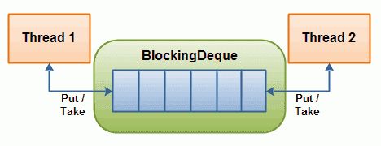

# Java - Concurrent Blocking Deque 阻塞双端队列

> 参考Jakob Jenkov的[java.util.concurrent](http://tutorials.jenkov.com/java-util-concurrent/index.html)

代表一个线程安全的队列，通常用于一个线程放入对象，另一个线程取出对象。可以对队列的两端执行操作。



- 如果这个阻塞队列达到容量上限，生产线程再尝试放入新的对象时会被阻塞，直到消费线程从队列中取出对象
- 如果消费线程尝试从一个空的队列中取出对象，它会被阻塞，直到生产线程向队列中放入对象
- 生产线程允许在队列两端插入
- 消费线程允许从队列两端取出

Operation     | Throw Exception | Special Value | Block        | Timeout
--------------| ---------------- | ------------- | ------------ | ------
Insert First  | addFirst(o)      | offerFirst(o) | putFirst(o)  | offerFirst(o, timeout, timeunit)
Remove First  | removeFirst(o)   | pollFirst(o)  | takeFirst(o) | pollFirst(timeout, timeunit)
Examine First | getFirst         | peekFirst(o)  |              |
Insert Last   | addLast(o)       | offerLast(o)  | putLast(o)   | offerLast(o, timeout, timeunit)
Remove Last   | removeLast(o)    | pollLast(o)   | takeLast(o)  | pollLast(timeout, timeunit)
Examine Last  | getLast          | peekLast(o)   |              |

- Throw Exception 如果企图的操作不可能立即完成，那么会抛出一个异常。
- Special Value 如果企图的操作不可能立即完成，那么会返回一个特殊的值（通常是true/false/null）。
- Block 如果企图的操作不可能立即完成，这个方法会阻塞，直到可以继续进行。
- Times Out 如果企图的操作不可能立即完成，这个方法会阻塞，但是阻塞的时间最长不会超过指定的timeout值，达到timeout后会返回一个特殊的值（通常是true/false/null）来告诉你操作是否成功。

#### *LinkedBlockingDeque*

```java
// LinkedBlockingDequeTest
public class LinkedBlockingDequeTest {

    private static DateFormat df = new SimpleDateFormat("yyyy-MM-dd HH-mm-ss");

    public static void main(String[] args) throws InterruptedException {
        testThrowExceptionOperation();
        // testSpecialValueOperation();
        // testBlockOperation();
        // testTimeoutOperation();
    }

    private static void testThrowExceptionOperation() {
        BlockingDeque<String> deque = new LinkedBlockingDeque<String>();
        deque.addFirst("p1");
        System.out.println(String.format("%s : producer : first : %s", df.format(new Date()), "p1"));

        String str = null;

        str = deque.removeLast();
        System.out.println(String.format("%s : consumer : last  : %s", df.format(new Date()), str));

        str = deque.removeFirst();
        System.out.println(String.format("%s : consumer : first : %s", df.format(new Date()), str));
    }

    private static void testSpecialValueOperation() {
        BlockingDeque<String> deque = new LinkedBlockingDeque<String>();
        deque.offerFirst("p1");
        System.out.println(String.format("%s : producer : first : %s", df.format(new Date()), "p1"));

        String str = null;

        str = deque.pollLast();
        System.out.println(String.format("%s : consumer : last  : %s", df.format(new Date()), str));

        str = deque.pollFirst();
        System.out.println(String.format("%s : consumer : first : %s", df.format(new Date()), str));
    }

    private static void testBlockOperation() throws InterruptedException {
        BlockingDeque<String> deque = new LinkedBlockingDeque<String>();
        deque.putFirst("p1");
        System.out.println(String.format("%s : producer : first : %s", df.format(new Date()), "p1"));

        String str = null;

        str = deque.takeLast();
        System.out.println(String.format("%s : consumer : last  : %s", df.format(new Date()), str));

        str = deque.takeFirst();
        System.out.println(String.format("%s : consumer : first : %s", df.format(new Date()), str));
    }

    private static void testTimeoutOperation() throws InterruptedException {
        BlockingDeque<String> deque = new LinkedBlockingDeque<String>();
        deque.offerFirst("p1", 1, TimeUnit.SECONDS);
        System.out.println(String.format("%s : producer : first : %s", df.format(new Date()), "p1"));

        String str = null;

        str = deque.pollLast(1, TimeUnit.SECONDS);
        System.out.println(String.format("%s : consumer : last  : %s", df.format(new Date()), str));

        str = deque.pollFirst(1, TimeUnit.SECONDS);
        System.out.println(String.format("%s : consumer : first : %s", df.format(new Date()), str));
    }

}

// 运行结果
// testThrowExceptionOperation
2017-03-13 10-08-48 : producer : first : p1
2017-03-13 10-08-48 : consumer : last  : p1
Exception in thread "main" java.util.NoSuchElementException
	at java.util.concurrent.LinkedBlockingDeque.removeFirst(LinkedBlockingDeque.java:453)
	at com.example.LinkedBlockingDequeTest.testThrowExceptionOperation(LinkedBlockingDequeTest.java:31)
	at com.example.LinkedBlockingDequeTest.main(LinkedBlockingDequeTest.java:15)

// testSpecialValueOperation
2017-03-13 10-10-30 : producer : first : p1
2017-03-13 10-10-30 : consumer : last  : p1
2017-03-13 10-10-30 : consumer : first : null

// testBlockOperation
2017-03-13 10-11-23 : producer : first : p1
2017-03-13 10-11-23 : consumer : last  : p1
...

// testTimeoutOperation
2017-03-13 10-11-50 : producer : first : p1
2017-03-13 10-11-50 : consumer : last  : p1
2017-03-13 10-11-51 : consumer : first : null
```

*PS：本文使用的是java-1.8*