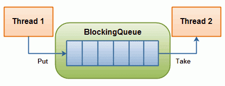

# Java - Concurrent Blocking Queue 阻塞队列

> 参考Jakob Jenkov的[java.util.concurrent](http://tutorials.jenkov.com/java-util-concurrent/index.html)

代表一个线程安全的队列，通常用于一个线程放入对象，另一个线程取出对象。



- 如果这个阻塞队列达到容量上限，生产线程再尝试放入新的对象时会被阻塞，直到消费线程从队列中取出对象
- 如果消费线程尝试从一个空的队列中取出对象，它会被阻塞，直到生产线程向队列中放入对象

## BlockingQueue实现类

- ArrayBlockingQueue
- DelayQueue
- LinkedBlockingQueue
- PriorityBlockingQueue
- SynchronousQueue

#### *ArrayBlockingQueue*

- 内部通过一个数组存储对象的
- 实例化时必须指定容量大小
- 存储对象遵循FIFO（先进先出）顺序

```java
// ArrayBlockingQueueTest
public class ArrayBlockingQueueTest {

    private static DateFormat df = new SimpleDateFormat("yyyy-MM-dd HH-mm-ss");

    public static void main(String[] args) throws InterruptedException {
        BlockingQueue<String> queue = new ArrayBlockingQueue<>(2);

        new Thread(new Producer(queue)).start();
        new Thread(new Consumer(queue)).start();

        do {
            Thread.sleep(1000);
        } while (queue.size() > 0);
    }

    /*
     * 生产者
     * 连续放入3个对象
     */
    static class Producer implements Runnable {
        protected BlockingQueue<String> queue = null;

        public Producer(BlockingQueue<String> queue) {
            this.queue = queue;
        }

        @Override
        public void run() {
            try {
                String str = null;
                for (int i = 1; i <= 3; i++) {
                    str = "p" + i;
                    queue.put(str);
                    System.out.println(String.format("%s : producer : %s", df.format(new Date()), str));
                }
            } catch (InterruptedException e) {
                e.printStackTrace();
            }
        }
    }

    /*
     * 消费者
     * 每3秒取出一个对象
     */
    static class Consumer implements Runnable {
        protected BlockingQueue<String> queue = null;

        public Consumer(BlockingQueue<String> queue) {
            this.queue = queue;
        }

        @Override
        public void run() {
            try {
                String str = null;

                for (int i = 1; i <= 3; i++) {
                    Thread.sleep(3000);
                    str = queue.take();
                    System.out.println(String.format("%s : consumer : %s", df.format(new Date()), str));
                }
            } catch (InterruptedException e) {
                e.printStackTrace();
            }
        }
    }

}

// 运行结果
2017-03-12 17-20-47 : producer : p1
2017-03-12 17-20-48 : producer : p2
2017-03-12 17-20-50 : consumer : p1
2017-03-12 17-20-50 : producer : p3
2017-03-12 17-20-53 : consumer : p2
2017-03-12 17-20-56 : consumer : p3
```

#### *DelayQueue*

- 内部会阻塞元素，直到一个确定的延迟过期（零或负数）
- 队列里的对象必须实现`java.util.concurrent.Delayed`接口
- 实现`Delayed.getDelay`方法，自定义延迟的规则
- 实现`Delayed.compareTo`方法，自定义队列的排序规则

```java
// DelayQueueTest
public class DelayQueueTest {

    private static DateFormat df = new SimpleDateFormat("yyyy-MM-dd HH-mm-ss");

    public static void main(String[] args) throws InterruptedException {
        BlockingQueue<Message> queue = new DelayQueue<>();

        new Thread(new Producer(queue)).start();
        new Thread(new Consumer(queue)).start();

        do {
            Thread.sleep(1000);
        } while (queue.size() > 0);
    }

    /*
     * 生产者
     * 连续放入3个对象，分别延时3秒、2秒、1秒
     */
    static class Producer implements Runnable {
        protected BlockingQueue<Message> queue = null;

        public Producer(BlockingQueue<Message> queue) {
            this.queue = queue;
        }

        @Override
        public void run() {
            try {
                Message message = null;

                for (int i = 1; i <= 3; i++) {
                    message = new Message("p" + i, 1000 * (4 - i));
                    queue.put(message);
                    System.out.println(String.format("%s : producer : %s", df.format(new Date()), message.content));
                }
            } catch (InterruptedException e) {
                e.printStackTrace();
            }
        }
    }

    /*
     * 消费者
     * 时刻检查队列，取出延时为零或负数的对象
     */
    static class Consumer implements Runnable {
        protected BlockingQueue<Message> queue = null;

        public Consumer(BlockingQueue<Message> queue) {
            this.queue = queue;
        }

        @Override
        public void run() {
            try {
                Message message = null;

                for (int i = 1; i <= 3; i++) {
                    message = queue.take();
                    System.out.println(String.format("%s : consumer : %s", df.format(new Date()), message.content));
                }
            } catch (InterruptedException e) {
                e.printStackTrace();
            }
        }
    }

    static class Message implements Delayed {

        public String content;
        private long delay;
        private long createdTime = System.currentTimeMillis();

        public Message(String content, long delay) {
            this.content = content;
            this.delay = delay;
        }

        /*
         * 零或负数表示可以马上取出
         */
        @Override
        public long getDelay(TimeUnit unit) {
            return createdTime - System.currentTimeMillis() + delay;// 延迟 delay 毫秒
        }

        /*
         * 决定对象在队列中的顺序
         */
        @Override
        public int compareTo(Delayed o) {
            return Long.compare(this.getDelay(TimeUnit.NANOSECONDS), o.getDelay(TimeUnit.NANOSECONDS));
        }
    }

}

// 运行结果
2017-03-12 17-18-59 : producer : p1
2017-03-12 17-18-59 : producer : p2
2017-03-12 17-18-59 : producer : p3
2017-03-12 17-19-00 : consumer : p3
2017-03-12 17-19-01 : consumer : p2
2017-03-12 17-19-02 : consumer : p1
```

#### *LinkedBlockingQueue*

- 内部通过一个链式结构存储对象的
- 可以设置容量大小，也可以不设置。如果不设置，最大为`Integer.MAX_VALUE`
- 存储对象遵循FIFO（先进先出）顺序

```java
// LinkedBlockingQueueTest
public class LinkedBlockingQueueTest {

    private static DateFormat df = new SimpleDateFormat("yyyy-MM-dd HH-mm-ss");

    public static void main(String[] args) throws InterruptedException {
        BlockingQueue<String> queue = new LinkedBlockingQueue<>();

        new Thread(new Producer(queue)).start();
        new Thread(new Consumer(queue)).start();

        do {
            Thread.sleep(1000);
        } while (queue.size() > 0);
    }

    /*
     * 生产者
     * 连续放入3个对象
     */
    static class Producer implements Runnable {
        protected BlockingQueue<String> queue = null;

        public Producer(BlockingQueue<String> queue) {
            this.queue = queue;
        }

        @Override
        public void run() {
            try {
                String str = null;
                for (int i = 1; i <= 3; i++) {
                    str = "p" + i;
                    queue.put(str);
                    System.out.println(String.format("%s : producer : %s", df.format(new Date()), str));
                }
            } catch (InterruptedException e) {
                e.printStackTrace();
            }
        }
    }

    /*
     * 消费者
     * 每3秒取出一个对象
     */
    static class Consumer implements Runnable {
        protected BlockingQueue<String> queue = null;

        public Consumer(BlockingQueue<String> queue) {
            this.queue = queue;
        }

        @Override
        public void run() {
            try {
                String str = null;

                for (int i = 1; i <= 3; i++) {
                    Thread.sleep(3000);
                    str = queue.take();
                    System.out.println(String.format("%s : consumer : %s", df.format(new Date()), str));
                }
            } catch (InterruptedException e) {
                e.printStackTrace();
            }
        }
    }

}

// 运行结果
2017-03-12 16-52-37 : producer : p1
2017-03-12 16-52-37 : producer : p2
2017-03-12 16-52-37 : producer : p3
2017-03-12 16-52-40 : consumer : p1
2017-03-12 16-52-43 : consumer : p2
2017-03-12 16-52-46 : consumer : p3
```

#### *PriorityBlockingQueue*

- 队列里的对象必须实现`java.lang.Comparable`接口
- 实现`Comparable.compareTo`方法，自定义队列的排序规则

```java
// PriorityBlockingQueueTest
public class PriorityBlockingQueueTest {

    private static DateFormat df = new SimpleDateFormat("yyyy-MM-dd HH-mm-ss");

    public static void main(String[] args) throws InterruptedException {
        BlockingQueue<Message> queue = new PriorityBlockingQueue<>();

        new Thread(new Producer(queue)).start();
        new Thread(new Consumer(queue)).start();

        do {
            Thread.sleep(1000);
        } while (queue.size() > 0);
    }

    /*
     * 生产者
     * 连续放入3个对象，以3、2、1排序
     */
    static class Producer implements Runnable {
        protected BlockingQueue<Message> queue = null;

        public Producer(BlockingQueue<Message> queue) {
            this.queue = queue;
        }

        @Override
        public void run() {
            try {
                Message message = null;

                for (int i = 1; i <= 3; i++) {
                    message = new Message("p" + i, 4 - i);
                    queue.put(message);
                    System.out.println(String.format("%s : producer : %s", df.format(new Date()), message.content));
                }
            } catch (InterruptedException e) {
                e.printStackTrace();
            }
        }
    }

    /*
     * 消费者
     * 延时3秒，然后连续取出对象
     */
    static class Consumer implements Runnable {
        protected BlockingQueue<Message> queue = null;

        public Consumer(BlockingQueue<Message> queue) {
            this.queue = queue;
        }

        @Override
        public void run() {
            try {
                Message message = null;

                Thread.sleep(3000);
                for (int i = 1; i <= 3; i++) {
                    message = queue.take();
                    System.out.println(String.format("%s : consumer : %s", df.format(new Date()), message.content));
                }
            } catch (InterruptedException e) {
                e.printStackTrace();
            }
        }
    }

    static class Message implements Comparable<Message> {

        public String content;
        private int order;

        public Message(String content, int order) {
            this.content = content;
            this.order = order;
        }

        /*
         * 决定对象在队列中的顺序
         */
        @Override
        public int compareTo(Message o) {
            return Integer.compare(this.order, o.order);
        }
    }

}

// 运行结果
2017-03-12 17-42-13 : producer : p1
2017-03-12 17-42-13 : producer : p2
2017-03-12 17-42-13 : producer : p3
2017-03-12 17-42-16 : consumer : p3
2017-03-12 17-42-16 : consumer : p2
2017-03-12 17-42-16 : consumer : p1
```

#### *SynchronousQueue*

- 只能容纳一个对象

```java
// SynchronousQueueTest
public class SynchronousQueueTest {

    private static DateFormat df = new SimpleDateFormat("yyyy-MM-dd HH-mm-ss");

    public static void main(String[] args) throws InterruptedException {
        BlockingQueue<String> queue = new SynchronousQueue<>();

        new Thread(new Producer(queue)).start();
        new Thread(new Consumer(queue)).start();

        do {
            Thread.sleep(1000);
        } while (queue.size() > 0);
    }

    /*
     * 生产者
     * 连续放入3个对象
     */
    static class Producer implements Runnable {
        protected BlockingQueue<String> queue = null;

        public Producer(BlockingQueue<String> queue) {
            this.queue = queue;
        }

        @Override
        public void run() {
            try {
                String str = null;
                for (int i = 1; i <= 3; i++) {
                    str = "p" + i;
                    queue.put(str);
                    System.out.println(String.format("%s : producer : %s", df.format(new Date()), str));
                }
            } catch (InterruptedException e) {
                e.printStackTrace();
            }
        }
    }

    /*
     * 消费者
     * 每3秒取出一个对象
     */
    static class Consumer implements Runnable {
        protected BlockingQueue<String> queue = null;

        public Consumer(BlockingQueue<String> queue) {
            this.queue = queue;
        }

        @Override
        public void run() {
            try {
                String str = null;

                for (int i = 1; i <= 3; i++) {
                    Thread.sleep(3000);
                    str = queue.take();
                    System.out.println(String.format("%s : consumer : %s", df.format(new Date()), str));
                }
            } catch (InterruptedException e) {
                e.printStackTrace();
            }
        }
    }

}

// 运行结果
2017-03-12 17-51-00 : producer : p1
2017-03-12 17-51-00 : consumer : p1
2017-03-12 17-51-03 : producer : p2
2017-03-12 17-51-03 : consumer : p2
2017-03-12 17-51-06 : producer : p3
2017-03-12 17-51-06 : consumer : p3
```

*PS：本文使用的是java-1.8*