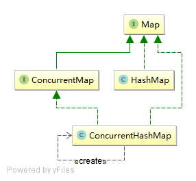

# Java - Concurrent Collection 集合

> 参考Jakob Jenkov的[java.util.concurrent](http://tutorials.jenkov.com/java-util-concurrent/index.html)

## ConcurrentMap

继承`java.util.Map`接口，新增`putIfAbsent()`、`replace()`、`remove()`等方法。

线程安全的实现类：

- ConcurrentHashMap
- ConcurrentNavigableMap

使用方法：

- get(key)
- put(key, value)
- putIfAbsent(key, value)
- replace(key, oldValue, newValue)
- remove(key, value)

## CopyOnWriteArrayList

## CopyOnWriteArraySet

*PS：本文使用的是java-1.8*