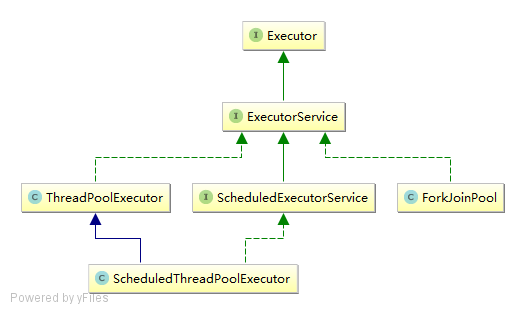

# Java - Concurrent Executor 执行器

> 参考Jakob Jenkov的[java.util.concurrent](http://tutorials.jenkov.com/java-util-concurrent/index.html)

ExecutorService接口代表了一种异步执行机制，可以在后台执行任务。使用线程池实现。



## 创建ExecutorService

可以使用`java.util.concurrent.Executors`工厂类快速创建。

```java
// 创建ExecutorService实例
ExecutorService executor1 = Executors.newSingleThreadExecutor();
ExecutorService executor2 = Executors.newFixedThreadPool(10);

// 创建ScheduledExecutorService实例
ScheduledExecutorService executor3 = Executors.newSingleThreadScheduledExecutor();
ScheduledExecutorService executor4 = Executors.newScheduledThreadPool(10);
```

## 关闭ExecutorService

当你使用完`ExecutorService`后，应该使用`shutdown()`方法关闭它，这样线程就不会继续运行了。`ExecutorService`并不会立即关闭，但是它也不会再接收新任务，当所有的线程完成了它们的任务后`ExecutorService`就会关闭。

如果你想立即结束`ExecutorService`，应该调用`shutdownNow()`方法，但是这个并没有保障，也许它们会停止也许会执行完。


## ExecutorService实现类

- ThreadPoolExecutor
- ScheduledThreadPoolExecutor
- ForkJoinPool

## ThreadPoolExecutor

内部维护着一个线程池，可以执行给定的任务。

```java
/**
 * @param corePoolSize 线程池维护线程的最少数量
 * @param maximumPoolSize 线程池维护线程的最大数量
 * @param keepAliveTime 线程池维护线程所允许的空闲时间
 * @param unit 线程池维护线程所允许的空闲时间的单位
 * @param workQueue 线程池所使用的缓冲队列
 * @param threadFactory 创建线程的工厂
 * @param handler 线程池对拒绝任务的处理策略
 */
public ThreadPoolExecutor(int corePoolSize,
                          int maximumPoolSize,
                          long keepAliveTime,
                          TimeUnit unit,
                          BlockingQueue<Runnable> workQueue,
                          ThreadFactory threadFactory,
                          RejectedExecutionHandler handler) {}
```

- execute(runnable)
- submit(runnable)
- submit(callable)
- invokeAny(callables)
- invokeAll(callables)

#### *execute(runnable)*

- 只接收一个`java.lang.Runnable`对象
- 没有返回结果

```java
executor.execute(new Runnable() {
    @Override
    public void run() {
        ...
    }
});
```

#### *submit(runnable)*

- 只接收一个`java.lang.Runnable`对象
- 返回`java.util.concurrent.Feture`对象，可以检查执行状态

```java
Future future = executor.submit(new Runnable() {
    @Override
    public void run() {
        ...
    }
});

Boolean isDone = future.isDone();
```

#### *submit(callable)*

- 只接收一个`java.util.concurrent.Callable`对象
- 返回`java.util.concurrent.Feture`对象，不仅可以检查执行状态，还能获取执行结果

```java
Future<String> future = executor.submit(new Callable<String>() {
    @Override
    public String call() throws Exception {
        ...
    }
});

String result = future.get();
```

#### *invokeAny(callables)*

- 可以接收多个`java.util.concurrent.Callable`对象
- 只返回一个执行结果，并且无法确定是那个任务的

```java
Set<Callable<String>> callables = new HashSet<>();

callables.add(new Callable<String>() {
    public String call() throws Exception {
        ...
    }
});

String result = executor.invokeAny(callables);
```

#### *invokeAll(callables)*

- 可以接收多个`java.util.concurrent.Callable`对象
- 返回所有任务的`java.util.concurrent.Feture`对象

```java
Set<Callable<String>> callables = new HashSet<>();

callables.add(new Callable<String>() {
    public String call() throws Exception {
        ...
    }
});

List<Future<String>> futures = executor.invokeAll(callables);
```

#### *ScheduledThreadPoolExecutor*

继承自ThreadPoolExecutor类，实现了ScheduledExecutorService接口，主要用于延迟执行、定时执行。

```java
/**
 * @param corePoolSize 线程池维护线程的最少数量
 * @param threadFactory 创建线程的工厂
 * @param handler 线程池对拒绝任务的处理策略
 */
public ScheduledThreadPoolExecutor(int corePoolSize,
                                   ThreadFactory threadFactory,
                                   RejectedExecutionHandler handler) {}
```

- schedule(runnable, delay, unit)
- schedule(callable, delay, unit)

#### *schedule(runnable, delay, unit)*

- 只接收一个`java.lang.Runnable`对象
- 可以设置延时时间
- 返回`java.util.concurrent.ScheduledFuture`对象，可以检查执行状态

```java
ScheduledFuture future = executor.schedule(new Runnable() {
    @Override
    public void run() {
        ...
    }
}, 3000, TimeUnit.MILLISECONDS);

Boolean isDone = future.isDone();
```

#### *schedule(callable, delay, unit)*

- 只接收一个`java.util.concurrent.Callable`对象
- 可以设置延时时间
- 返回`java.util.concurrent.ScheduledFuture`对象，不仅可以检查执行状态，还能获取执行结果

```java
ScheduledFuture<String> future = executor.schedule(new Callable<String>() {
    @Override
    public String call() throws Exception {
        ...
    }
}, 3000, TimeUnit.MILLISECONDS);

String result = future.get();
```

#### *ForkJoinPool*

使用分治法来解决问题。

```java
/**
 * @param parallelism 
 * @param threadFactory 
 * @param handler 
 * @param asyncMode 
 */
public ForkJoinPool(int parallelism,
                    ForkJoinWorkerThreadFactory threadFactory,
                    UncaughtExceptionHandler handler,
                    boolean asyncMode) {}
```

- invoke(task)

```java
// RecursiveAction接口没返回值
executor.invoke(new RecursiveAction() {
    @Override
    protected void compute() {
        
    }
});

// RecursiveTask接口有返回值
Integer sum = executor.invoke(new RecursiveTask<Integer>() {
    @Override
    protected Integer compute() {
        ...
    }
});
```

*PS：本文使用的是java-1.8*