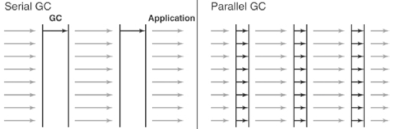

# Java - JVM 虚拟机


## 类加载器

#### 什么是类的加载

类的加载指的是将类的.class文件中的二进制数据读入到内存中，将其放在运行时数据区的方法区内，然后在堆区创建一个java.lang.Class对象，用来封装类在方法区内的数据结构，并且向Java程序员提供了访问方法区内的数据结构的接口。


类加载器并不需要等到某个类被“首次主动使用”时再加载它，JVM规范允许类加载器在预料某个类将要被使用时就预先加载它，如果在预先加载的过程中遇到了.class文件缺失或存在错误，类加载器必须在程序首次主动使用该类时才报告错误（LinkageError错误）如果这个类一直没有被程序主动使用，那么类加载器就不会报告错误。

加载.class文件的方式

- 从本地系统中直接加载
- 通过网络下载.class文件
- 从zip，jar等归档文件中加载.class文件
- 从专有数据库中提取.class文件
- 将Java源文件动态编译为.class文件

#### 类的生命周期

其中类加载的过程包括了加载、验证、准备、解析、初始化五个阶段。在这五个阶段中，加载、验证、准备和初始化这四个阶段发生的顺序是确定的，而解析阶段则不一定，它在某些情况下可以在初始化阶段之后开始，这是为了支持Java语言的运行时绑定（也成为动态绑定或晚期绑定）。另外注意这里的几个阶段是按顺序开始，而不是按顺序进行或完成，因为这些阶段通常都是互相交叉地混合进行的，通常在一个阶段执行的过程中调用或激活另一个阶段。


```java
/*
 * 常量在准备阶段赋值
 */
private static final short s = 1;
private static final int i = 2;
private static final long l = 3L;
private static final float f = 4.0F;
private static final double d = 5.0D;
private static final char c = 'f';
private static final boolean b = true;
```

#### 类的加载机制

- 全盘负责

当一个类加载器负责加载某个Class时，该Class所依赖的和引用的其他Class也将由该类加载器负责载入，除非显示使用另外一个类加载器来载入

- 父类委托

先让父类加载器试图加载该类，只有在父类加载器无法加载该类时才尝试从自己的类路径中加载该类

- 缓存机制

缓存机制将会保证所有加载过的Class都会被缓存，当程序中需要使用某个Class时，类加载器先从缓存区寻找该Class，只有缓存区不存在，系统才会读取该类对应的二进制数据，并将其转换成Class对象，存入缓存区。这就是为什么修改了Class后，必须重启JVM，程序的修改才会生效

#### 双亲委派模型

双亲委派模型的工作流程是：如果一个类加载器收到了类加载的请求，它首先不会自己去尝试加载这个类，而是把请求委托给父加载器去完成，依次向上，因此，所有的类加载请求最终都应该被传递到顶层的启动类加载器中，只有当父加载器在它的搜索范围中没有找到所需的类时，即无法完成该加载，子加载器才会尝试自己去加载该类。

1. 当AppClassLoader加载一个class时，它首先不会自己去尝试加载这个类，而是把类加载请求委派给父类加载器ExtClassLoader去完成。
2. 当ExtClassLoader加载一个class时，它首先也不会自己去尝试加载这个类，而是把类加载请求委派给BootStrapClassLoader去完成。
3. 如果BootStrapClassLoader加载失败（例如在$JAVA_HOME/jre/lib里未查找到该class），会使用ExtClassLoader来尝试加载；
4. 若ExtClassLoader也加载失败，则会使用AppClassLoader来加载，如果AppClassLoader也加载失败，则会报出异常ClassNotFoundException。

```java
protected Class<?> loadClass(String name, boolean resolve) throws ClassNotFoundException {
    synchronized (getClassLoadingLock(name)) {
        // 首先判断该类型是否已经被加载
        Class<?> c = findLoadedClass(name);
        
        if (c == null) {
            // 如果没有被加载，就委托给父类加载或者委派给启动类加载器加载
            long t0 = System.nanoTime();
            try {
                if (parent != null) {
                    // 如果存在父类加载器，就委派给父类加载器加载
                    c = parent.loadClass(name, false);
                } else {
                    // 如果不存在父类加载器，就检查是否是由启动类加载器加载的类，
                    // 通过调用本地方法native Class findBootstrapClass(String name)
                    c = findBootstrapClassOrNull(name);
                }
            } catch (ClassNotFoundException e) { }

            if (c == null) {
                // 如果父类加载器和启动类加载器都不能完成加载任务，才调用自身的加载功能
                long t1 = System.nanoTime();
                c = findClass(name);

                ...
            }
        }
        if (resolve) {
            resolveClass(c);
        }
        return c;
    }
}
```

双亲委派模型意义：

- 系统类防止内存中出现多份同样的字节码
- 保证Java程序安全稳定运行

#### 类的加载

类加载有三种方式：

- 命令行启动应用时候由JVM初始化加载
- 通过`Class.forName()`方法动态加载
- 通过`ClassLoader.loadClass()`方法动态加载

```java
public class ClassLoaderTest {
    public static void main(String[] args) throws ClassNotFoundException {
        ClassLoader loader = Thread.currentThread().getContextClassLoader();

        System.out.println("classLoader: " + loader);

        // 使用ClassLoader.loadClass()来加载类，不会执行初始化块
        loader.loadClass("com.example.class_loader.Bar1");

        // 使用Class.forName()来加载类，默认会执行初始化块
        Class.forName("com.example.class_loader.Bar2");// 打印输出：Bar2 静态初始化块执行了！

        //使用Class.forName()来加载类，并指定ClassLoader，初始化时不执行静态块
        Class.forName("com.example.class_loader.Bar3", false, loader);
    }
}
```

`Class.forName()`和`ClassLoader.loadClass()`区别：

- `Class.forName()` 将类的.class文件加载到jvm中之外，还会对类进行解释，执行类中的static块
- `ClassLoader.loadClass()` 只干一件事情，就是将.class文件加载到jvm中，不会执行static中的内容，只有在newInstance才会去执行static块

*注：`Class.forName(name, initialize, loader)` 带参函数也可控制是否加载static块*

#### 自定义类加载器

通常情况下，我们都是直接使用系统类加载器。但是，有的时候，我们也需要自定义类加载器。比如应用是通过网络来传输Java类的字节码，为保证安全性，这些字节码经过了加密处理，这时系统类加载器就无法对其进行加载，这样则需要自定义类加载器来实现。

自定义类加载器一般都是继承自`ClassLoader`类，从上面对`loadClass`方法来分析来看，我们只需要重写`findClass`方法即可。

```java
public class MyClassLoader extends ClassLoader {
    @Override
    protected Class<?> findClass(String name) throws ClassNotFoundException {
        byte[] classData = loadClassData(name);
        if (classData == null) {
            throw new ClassNotFoundException();
        } else {
            return defineClass(name, classData, 0, classData.length);
        }
    }

    private byte[] loadClassData(String className) {
        String fileName = root + File.separatorChar + className.replace('.', File.separatorChar) + ".myclass";
        try {
            InputStream ins = new FileInputStream(fileName);
            ByteArrayOutputStream baos = new ByteArrayOutputStream();
            int bufferSize = 1024;
            byte[] buffer = new byte[bufferSize];
            int length = 0;
            while ((length = ins.read(buffer)) != -1) {
                baos.write(buffer, 0, length);
            }
            return baos.toByteArray();
        } catch (IOException e) {
            e.printStackTrace();
        }
        return null;
    }
    ...
}
```

```java
public class MyClassLoaderTest {
    public static void main(String[] args) {
        MyClassLoader classLoader = new MyClassLoader();
        classLoader.setRoot(getRootDir());

        Class<?> myBarClass = null;
        try {
            myBarClass = classLoader.loadClass("com.example.class_loader.MyBar");
            Object myBar = myBarClass.newInstance();
            System.out.println("classLoader: " + myBar.getClass().getClassLoader());
        } catch (ClassNotFoundException e) {
            e.printStackTrace();
        } catch (InstantiationException e) {
            e.printStackTrace();
        } catch (IllegalAccessException e) {
            e.printStackTrace();
        }
    }
}
```

## JVM内存模型


- -Xms 设置堆的最小空间大小。空余堆内存小于40%时，JVM就会增大堆直到-Xmx的最大限制
- -Xmx 设置堆的最大空间大小。空余堆内存大于70%时，JVM就会减少堆直到-Xms的最小限制
- -Xmn 设置新生代内存大小的最大值，包括E区和两个S区的总和
- -Xss 设置每个线程的堆栈大小
- -XX:NewSize 设置新生代最小空间大小
- -XX:MaxNewSize 设置新生代最大空间大小
- -XX:PermSize 设置永久代最小空间大小
- -XX:MaxPermSize 设置永久代最大空间大小
- -XX:SurvivorRatio=1:8 设置Eden与Survivor的比例
- -XX:NewRatio=1:2 设置Young与Old的比例

## JVM垃圾回收

#### JVM内存分配策略

- 对象优先在Eden区分配

如果Eden区不足分配对象，会做一个Young GC，存活对象被存入Survivor区，回收内存。

然后再尝试分配对象，如果依然不足分配，才分配到Old区。

- 大对象直接进入老年代

大对象是指需要大量连续内存空间的Java对象，最典型的大对象就是那种很长的字符串及数组。

虚拟机提供了一个-XX:PretenureSizeThreshold参数，令大于这个设置值的对象直接在老年代中分配。

这样做的目的是避免在Eden区及两个Survivor区之间发生大量的内存拷贝（新生代采用复制算法收集内存）。

PretenureSizeThreshold参数只对Serial和ParNew两款收集器有效。

- 长期存活的对象将进入老年代

每经历一次Young GC，对象年龄（Age）就会增加1岁。

当年龄增加到一定程度（默认为15岁），就会被晋升Old区。

对象晋升老年代的年龄阈值，可以通过参数-XX:MaxTenuringThreshold来设置。

在经历了多次的Young GC后仍然存活：在触发了Young GC后，存活对象被存入Survivor区。

- 动态对象年龄判定

为了能更好地适应不同程序的内存状况，虚拟机并不总是要求对象的年龄必须达到MaxTenuringThreshold才能晋升老年代。

如果在Survivor空间中相同年龄所有对象大小的总和大于Survivor空间的一半，年龄大于或等于该年龄的对象就可以直接进入老年代，无须等到MaxTenuringThreshold中要求的年龄。

- 空间分配担保

在发生Young GC时，虚拟机会检测之前每次晋升到老年代的平均大小是否大于老年代的剩余空间大小。

如果大于，则改为直接进行一次Full GC。

如果小于，则查看HandlePromotionFailure设置是否允许担保失败。如果允许，那只会进行Young GC，如果不允许，则也要改为进行一次Full GC。

大部分情况下都还是会将HandlePromotionFailure开关打开，避免Full GC过于频繁。

#### GC类型

- Serial GC
- Serial Old GC
- Parallel GC
- Parallel Old GC jdk-1.6
- ParNew GC
- Concurrent Mark & Sweep GC（CMS GC） jdk-1.5
- Garbage First GC（G1 GC）

#### Serial GC（-XX:+UseSerialGC）


- 单线程串行
- mark-sweep-compact 标记-清理-压缩

#### Serial Old GC


#### Parallel GC（-XX:+UseParallelGC）



- 多线程并行
- mark-sweep-compact 标记-清理-压缩
- -XX:+UseParallelGC=3 设置并发线程数
- -XX:MaxGCPauseMillis 大于0的毫秒值，尽可能保证垃圾收集耗时不超过该值
- -XX:GCTimeRatio 大于0小于100的整数，垃圾收集耗时占总运行时间的比例
- -XX:+UseAdaptiveSizePolicy 自适应调节策略

#### Parallel Old GC（-XX:+UseParallelOldGC）

- 多线程并行
- mark-summary-compact 标记-总结-压缩
- -XX:+UseAdaptiveSizePolicy

#### ParNew GC（-XX:+UseParNewGC）


#### CMS GC（-XX:+UseConcMarkSweepGC）


- 多线程并发
- mark-sweep 标记-清理
- Initial Mark 初始标记 --> Concurrent Mark 并发标记 --> Remark 重标记 --> Concurrent Sweep 并发清理
- -XX:+UseCMSCompactAtFullCollection 启动压缩
- -XX:+UseConcMarkSweepGC=3 设置并发线程数

#### G1 GC（-XX:UseG1GC）


#### GC组合


Type                    | Young       | Old/Perm
----------------------- | ----------- | ---------
-XX:+UseSerialGC        | Serial GC   | Serial Old GC
-XX:+UseParallelGC      | Parallel GC | Serial Old GC
-XX:+UseParNewGC        | ParNew GC   | Serial Old GC
-XX:+UseParallelOldGC   | Parallel GC | Parallel Old GC
-XX:+UseConcMarkSweepGC | ParNew GC   | CMS GC/Serial Old GC

不支持组合：

- -XX:+UseParNewGC -XX:+UseSerialGC
- -XX:+UseParNewGC -XX:+UseParallelOldGC

#### GC日志

- -XX:+PrintGC 开启GC日志，为每一次Young GC和每一次Full GC打印一行信息
- -XX:PrintGCDetails 开启详情GC日志，日志格式与GC算法有关
- -XX:+PrintGCTimeStamps 为每一行日志添加时间
- -XX:+PrintGCDateStamps 为第一行日志添加日期和时间
- -Xloggc=d://gc.log GC日志默认输出到终端，也可以通过些参数输出到指定文件

## 内存泄漏

- 静态集合类
- 监听器
- 单例
- 生命周期长的对象引用生命周期短的对象

```java
Object o1 = new Object();
Object o2 = o1;
o1 = null; // 这时o1指向的那个对象回收了吗？没有，因为它还被o2引用着
o2 = null; // 这样才能回收
```

## JVisualVM 远程监听

第一步：创建`jstatd.all.policy`文件
 
 ```text
grant codebase "file:${java.home}/../lib/tools.jar" {
    permission java.security.AllPermission;
};
```

第二步：启动 jstatd 服务

```shell
jstatd -J-Djava.security.policy=jstatd.all.policy 
```

- `-J-Djava.security.policy=POLICY_FILENAME` 指定配置文件
- `-J-Djava.rmi.server.hostname=HOSTNAME` 指定IP地址
- `-p PORT` 默认1099

启动JMX：

- `-J-Dcom.sun.management.jmxremote.port=PORT` 
- `-J-Dcom.sun.management.jmxremote.ssl=false`
- `-J-Dcom.sun.management.jmxremote.authenticate=false`

完整示例：

```shell
jstatd -J-Djava.security.policy=jstatd.all.policy -J-Djava.rmi.server.hostname=192.168.198.187 -p 1099 -J-Dcom.sun.management.jmxremote.port=9888 -J-Dcom.sun.management.jmxremote.ssl=false -J-Dcom.sun.management.jmxremote.authenticate=false
```